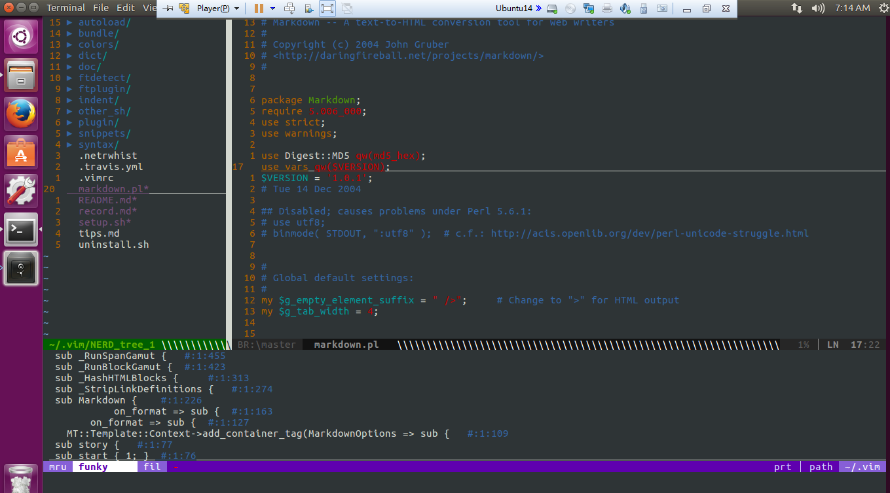
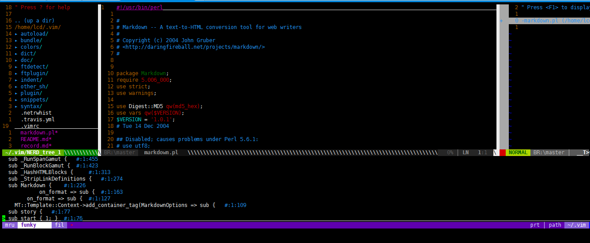

# orientlu's vim配置文件


### 运行截图

* GVIM


* Ubuntu Terminal


* Use ssh from xshel



* 打开终端，执行下面的命令就自动安装好了：
```
wget -qO- https://raw.github.com/orientlu/vim/master/setup.sh | sh -x
```

手动升级安装 ctags/gtags [install_tags](install_tags.md)

### 使用说明：

* [使用说明](record.md)
* [插件说明](pluin_doc/pluin_doc.md)
